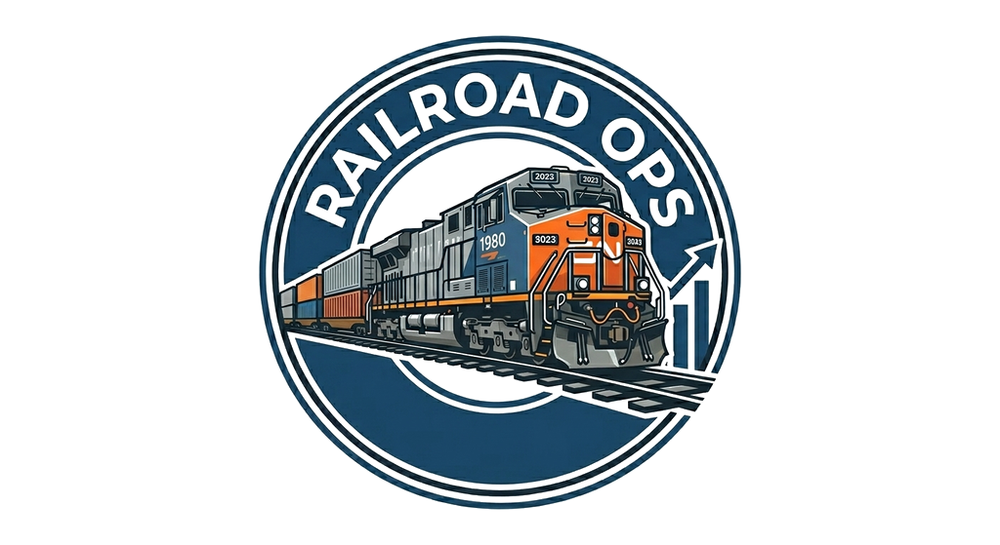

  

<h1 align="center">Railroad Ops</h1>

  <strong>Cloud-native operations platform for model railroaders.</strong>

  Replace the spreadsheet, the binder of car cards, and the printout of train symbols
  with one tool for layouts, rolling stock, waybills, and operating sessions.

  <a href="https://railroadops.com">railroadops.com</a>
  &middot;
  <a href="https://railroadops.com/pricing">Pricing</a>
  &middot;
  <a href="https://railroadops.com/features">Features</a>

  

---

## What it does

Railroad Ops is a web app for model railroad operations. It gives hobbyists and clubs a
single place to model their layout, manage rolling stock, generate prototypical paperwork,
and run operating sessions — without maintaining spreadsheets and manila folders.

The app is designed around how real railroads actually work: locations contain industries,
industries ship commodities, freight cars get routed on four-panel waybills, and trains
pick up and set out cars based on switch lists generated for each session. Everything is
tied together so that a crew running a session can see, in order, every move they need to
make.

## Features

### Layout and infrastructure
- Multiple layouts per account — model every railroad you own
- Locations typed as passenger stations, yards, interchanges, junctions, staging, team
  tracks, or sidings
- Industries attached to locations, with shipping and receiving commodities
- Yard tracks (arrival, classification, departure, RIP, engine service, etc.) with
  per-track capacity

### Rolling stock
- Locomotives with DCC address, decoder, horsepower, and service type
- Freight cars with AAR type codes, reporting marks, and commodity lists
- Passenger cars, MOW equipment, and cabooses — each a first-class citizen
- Bad order tracking and maintenance tasks tied to specific pieces of equipment
- Silhouette icons for consistent visual representation across the UI

### Waybills and car cards
- Four-panel waybill system with loaded/empty cycles
- Car cards linking a physical car to its current waybill and location
- Shipper and consignee industries resolve to real locations in your layout

### Trains and consists
- Train definitions with class, service type, origin, destination, and ordered stops
- Session consists composed of locomotives, rolling stock, and cabooses in any order
- Printable switch lists generated per consist per session

### Operating sessions
- Create, start, and complete sessions with timestamps
- Assign trains to sessions
- Auto-generated switch lists per train for crew to run during the session

### Crew management
- Invite crew by email or shareable link
- Custom roles with per-section view/edit permissions
- Seat-based billing: 1 crew seat included with Pro, additional seats $5/mo each
  (up to 10 total)

### Account and billing
- **Free tier:** 1 layout, 50 total items, no crew
- **Pro tier:** $5/mo, 5 layouts, unlimited items, 1 included crew seat
- Stripe Checkout and Customer Portal integration
- Multi-factor authentication (TOTP)
- Email verification and password reset flows

## License

Railroad Ops is source-available under the [Business Source License 1.1](LICENSE).

- Non-production use and evaluation are permitted.
- Running a competing model-railroad-ops service is **not** permitted.
- The license auto-converts to Mozilla Public License 2.0 on **2030-04-18**.

For commercial licensing inquiries, email **support@railroadops.com**.

---

  Built by <a href="https://github.com/FoxxDev-Collab">Jeremiah Price</a> · © 2026

